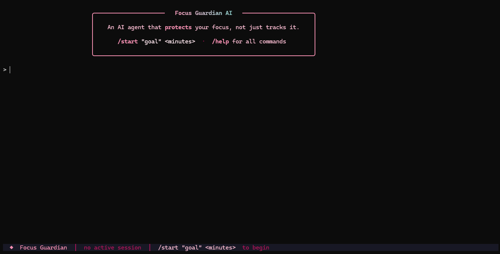
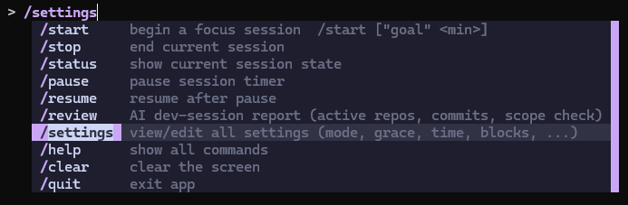
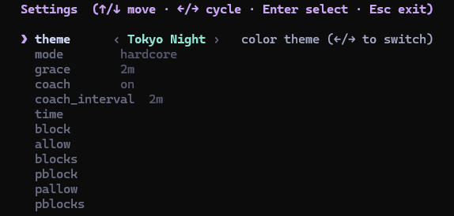

# Focus Guardian AI

An AI focus companion that does more than track time. It watches for distractions, explains what it sees, and takes action when a session drifts off course.

## What It Is

Focus Guardian AI is a terminal-first productivity assistant built for focused work sessions and hackathon demos. It combines session management, distraction detection, and policy-driven interventions in a single CLI experience.

## Screenshots

<p align="center">
        
</p>

<p align="center">
        
</p>

<p align="center">
        
</p>

## Why It Stands Out

- Designed for a real workflow, not a toy demo
- Rules-first decision engine with AI used only when context is ambiguous
- Clear terminal UX with fast command completion and session visibility
- Action-oriented behavior: warn, block, or redirect when needed
- Built to be stable in a controlled demo environment

## Core Capabilities

- Start and manage focus sessions from the terminal
- Inspect session status, summaries, and live logs
- Detect distracting browsing behavior in a controlled Playwright session
- Apply soft or strict enforcement modes
- Keep user-defined allow and block lists

## How It Works

1. The terminal UI captures commands and shows the current session state.
2. The orchestrator coordinates the session loop and decision flow.
3. The detector reads browser and window context from the active session.
4. The policy engine decides whether to allow, warn, or block.
5. The tools layer applies the action and records the outcome.

## Project Structure

| Module | Responsibility |
|---|---|
| [main.py](app/main.py) | Application entry point and dependency wiring |
| [cli.py](app/cli.py) | Slash-command parsing and command dispatch |
| [ui.py](app/ui.py) | Terminal dashboard, logs, and session panels |
| [orchestrator.py](app/orchestrator.py) | Main session loop and decision flow |
| [session.py](app/session.py) | Session lifecycle and timer management |
| [policy.py](app/policy.py) | Rules-first decision engine |
| [detector.py](app/detector.py) | Browser and window context collection |
| [tools.py](app/tools.py) | Enforcement actions such as warn, block, redirect |
| [ai.py](app/ai.py) | Gemini-based classification for ambiguous cases |
| [storage.py](app/storage.py) | Persistence for sessions, events, and analytics |
| [models.py](app/models.py) | Data models used across the app |

## Demo Scope

- Controlled Playwright browser instead of arbitrary system browsers
- Rules-first policy with AI escalation only when needed
- Focused command set for a polished demo flow
- Two operating modes: soft enforcement and strict enforcement

## Commands

```text
/start "Study OS for 90 min"
/stop
/status
/pause
/resume
/mode strict | soft
/block <domain>
/allow <domain>
/summary
```

## Installation

**macOS / Linux**

```bash
pip3 install rich prompt_toolkit
```

**Windows**

```powershell
.venv/Scripts/python.exe -m pip install rich prompt_toolkit
```

## Running

**macOS / Linux**

```bash
python3 -m app.main
```

**Windows**

```powershell
.venv/Scripts/python.exe -m app.main
```

## Tech Stack

- Python 3.11+
- Rich for terminal rendering
- prompt_toolkit for interactive command completion
- Playwright for controlled browser context
- Google Generative AI (Gemini) for reasoning on edge cases
- SQLite for local persistence
